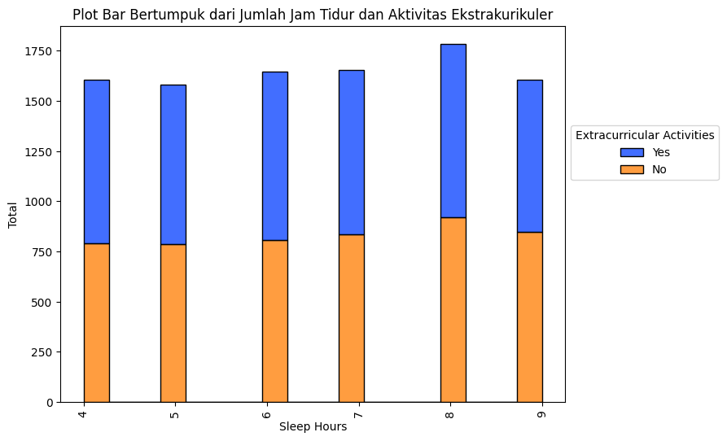

# Laporan Proyek Machine Learning - Bima Rakajati

## Domain Proyek

  

Indeks prestasi siswa merupakan salah satu indikator penting dalam menilai kinerja akademis siswa. Mengetahui faktor-faktor yang memengaruhi indeks prestasi siswa dapat membantu institusi pendidikan dalam merancang strategi yang efektif untuk meningkatkan kualitas pendidikan. Penelitian menunjukkan bahwa prestasi siswa dipengaruhi oleh berbagai faktor, baik internal seperti psikologi dan motivasi, maupun eksternal seperti jumlah jam belajar, lingkungan, dan keaktifan berorganisasi [[1]](https://journal.univawalbros.ac.id/index.php/jham/article/view/56)[[2]](https://ojs.unimal.ac.id/averrous/article/view/3040). Masalah ini penting untuk diselesaikan karena indeks prestasi yang baik tidak hanya mencerminkan kemampuan akademis siswa, tetapi juga dapat mempengaruhi masa depan mereka dalam hal peluang pendidikan lanjutan dan karir [[3]](https://www.researchgate.net/publication/372790243_Penerapan_Data_Mining_Untuk_Memprediksi_Prestasi_Akademik_Mahasiswa_Menggunakan_Algoritma_C45_dengan_CRISP-DM).

Untuk menyelesaikan masalah ini, kita dapat menggunakan teknik *machine learning* untuk memprediksi indeks prestasi siswa berdasarkan berbagai faktor seperti jumlah jam belajar, nilai sebelumnya, partisipasi dalam kegiatan ekstrakurikuler, jumlah jam tidur, dan jumlah soal latihan yang dikerjakan. Dengan menggunakan model *machine learning*, kita dapat mengidentifikasi pola dan hubungan antara variabel-variabel tersebut dan indeks prestasi siswa.

Hasil riset terkait menunjukkan bahwa penggunaan *machine learning* dalam bidang pendidikan dapat memberikan wawasan yang berharga untuk meningkatkan hasil belajar siswa. Sebagai contoh, penelitian oleh [[4]](https://www.daaam.info/Downloads/Pdfs/proceedings/proceedings_2018/059.pdf) menunjukkan bahwa algoritma *machine learning* dapat digunakan untuk memberikan nilai kepada siswa, meningkatkan daya ingat siswa, dan memprediksi kinerja akademis siswa dengan akurasi yang tinggi. Selain itu, penelitian oleh [[5]](https://repository.uinjkt.ac.id/dspace/bitstream/123456789/78230/1/Skripsi_Sadewo_Aji_Guno_111170170000015%20.pdf) menekankan pentingnya penggunaan *machine learning* dalam pendidikan untuk mengidentifikasi faktor-faktor yang memengaruhi kemampuan berpikir kreatif matematis siswa seperti minat belajar siswa, lingkungan sosial siswa, pengalaman belajar siswa, sumber belajar siswa, pekerjaan orang tua, dan jarak tempat tinggal siswa ke sekolah

Dengan demikian, proyek ini bertujuan untuk mengembangkan model *machine learning* yang dapat memprediksi indeks prestasi siswa berdasarkan faktor-faktor yang relevan. Model ini diharapkan dapat membantu institusi pendidikan dalam mengidentifikasi area yang perlu ditingkatkan dan merancang strategi yang lebih efektif untuk meningkatkan kinerja akademis siswa.

## Business Understanding

    

### Problem Statements

Berdasarkan latar belakang yang telah dijelaskan di atas, maka diperoleh rumusan masalah yang akan diselesaikan pada proyek ini, yaitu:
1. Apa faktor-faktor yang memengaruhi indeks prestasi siswa?
2. Bagaimana cara melakukan tahap persiapan data sebelum digunakan untuk membuat model *machine learning*?
3. Bagaimana cara membuat model *machine learning* untuk melakukan prediksi indeks prestasi siswa?

### Goals

Berdasarkan problem statements, berikut tujuan yang ingin dicapai pada proyek ini, yaitu:
1. Mengetahui faktor-faktor yang memengaruhi indeks prestasi siswa.
2. Mengetahui tahap-tahap persiapan data sebelum digunakan untuk membuat model *machine learning*.
3. Membuat model *machine learning* yang dapat melakukan prediksi indeks prestasi siswa.

### Solution statements

1. Melakukan proses *Exploratory Data Analysis* (EDA) untuk mengetahui faktor-faktor yang memengaruhi indeks prestasi siswa.
2. Menggunakan 3 model *machine learning* untuk memprediksi indeks prestasi pada siswa, yaitu *K-Nearest Neighbors* (KNN), *Random Forest*, dan *Support Vector Machine* (SVM).
3. Menggunakan metrik `MSE` dan `RMSE` pada masing-masing model *machine learning* untuk menemukan model terbaik berdasarkan akurasi tertinggi.

## Data Understanding

  

Dataset yang digunakan untuk memprediksi indeks prestasi pada siswa diambil dari [`Kaggle`](https://www.kaggle.com/) Dataset [`Student Performance (Multiple Linear Regression)`](https://www.kaggle.com/datasets/nikhil7280/student-performance-multiple-linear-regression) yang dipublikasikan oleh [`nikhil7280`](https://www.kaggle.com/nikhil7280) dengan usability score `10/10`. Dataset ini memiliki `10.000` baris dengan `6` kolom dan terdiri dari `1` file csv.

### Variabel-variabel pada dataset Student Performance
Dataset ini memiliki `17` variabel dengan keterangan sebagai berikut:
Variabel | Keterangan
----------|----------
Hours Studied | Jumlah total jam yang dihabiskan untuk belajar oleh setiap siswa.
Previous Scores | Nilai yang diperoleh siswa pada tes sebelumnya.
Extracurricular Activities | Apakah siswa berpartisipasi dalam kegiatan ekstrakurikuler (Ya atau Tidak).
Sleep Hours | Rata-rata jumlah jam tidur yang dimiliki siswa per hari.
Sample Question Papers Practiced | Jumlah contoh soal yang dipraktekkan siswa.
Performance Index | Ukuran kinerja keseluruhan setiap siswa. Indeks kinerja menunjukkan kinerja akademis siswa dan telah dibulatkan ke bilangan bulat terdekat. Indeks berkisar antara 10 hingga 100, dengan nilai yang lebih tinggi menunjukkan kinerja yang lebih baik.

Pada variabel `Extracurricular Activities` setiap nilai memiliki arti masing-masing. Berikut penjelasannya:

Nilai | Keterangan
----------|----------
Yes | Siswa berpartisipasi dalam kegiatan ekstrakurikuler.
No | Siswa tidak berpartisipasi dalam kegiatan ekstrakurikuler.

### Data Cleaning

Setelah diperiksa apakah terdapat kolom yang bernilai null, hasilnya adalah tidak ada. Sementara itu, setelah diperiksa apakah terdapat data duplikat, ditemukan 127 duplikat, sehingga data duplikat ini dihapus. Oleh karena itu, setelah dilakukan pembersihan data, diperoleh deskripsi statistik data numerik sebagai berikut:
| Statistic   | Hours Studied | Previous Scores | Sleep Hours | Sample Question Papers Practiced | Performance Index |
|-------------|---------------|------------------|-------------|------------------------------------|-------------------|
| count       | 9873.000000   | 9873.000000      | 9873.000000 | 9873.000000                        | 9873.000000       |
| mean        | 4.992100      | 69.441102        | 6.531652    | 4.583004                           | 55.216651         |
| std         | 2.589081      | 17.325601        | 1.697683    | 2.867202                           | 19.208570         |
| min         | 1.000000      | 40.000000        | 4.000000    | 0.000000                           | 10.000000         |
| 25%         | 3.000000      | 54.000000        | 5.000000    | 2.000000                           | 40.000000         |
| 50% (median)| 5.000000      | 69.000000        | 7.000000    | 5.000000                           | 55.000000         |
| 75%         | 7.000000      | 85.000000        | 8.000000    | 7.000000                           | 70.000000         |
| max         | 9.000000      | 99.000000        | 9.000000    | 9.000000                           | 100.000000        |

Dari hasil tersebut, dapat disimpulkan bahwa rata-rata dari variabel `Hours Studied` adalah 4.9, `Previous Scores` adalah 69.5, `Sleep Hours` adalah 6.5, `Sample Question Papers Practiced` adalah 4.5, dan `Performance Index` adalah 55.2.

  

Dari hasil di atas, terlihat bahwa tidak ada data outlier pada dataset ini. Sehingga, kita dapat melanjutkan ke tahap berikutnya.

### Univariate Analysis

Dari variabel-variabel yang diketahui, variabel dapat dibagi menjadi 2 jenis, yaitu variabel numerikal dan variabel kategorikal. Berikut merupakan kolom-kolom yang termasuk dalam variabel numerikal maupun kategorikal.

1. **Kolom-kolom numerikal:** `Hours Studied`, `Previous Scores`, `Sleep Hours`, `Sample Question Papers Practiced`, `Performance Index`
2. **Kolom-kolom kategorikal:** `Extracurricular Activities`

Pertama, kita akan memvisualisasikan kolom-kolom kategorikal untuk melihat jumlah-jumlah nilai kategorikal menggunakan pie chart.

  

Dari hasil di atas, terlihat bahwa jumlah siswa yang melakukan aktivitas ekstrakurikuler ($49.5\%$) lebih sedikit dibandingkan dengan yang tidak melakukan aktivitas ekstrakurikuler ($50.5\%$).

Selanjutnya, kita akan memvisualisasikan kolom-kolom numerikal untuk melihat distribusi data menggunakan histogram.

  

Gambar di atas dapat diinterpretasikan sebagai berikut:
1. Plot Histogram dari `Jumlah Jam Belajar`, `Nilai sebelumnya`, `Jumlah Jam Tidur`, dan `Jumlah Soal Latihan Yang Dikerjakan` tidak berdistribusi normal.
2. Plot Histogram dari `Indeks Prestasi` cukup berdistribusi normal.

### Multivariate Analysis

#### 1. Membandingkan Tingkat Hours Studied Pada Setiap Performance Index

  

Dari hasil di atas, terlihat bahwa semakin banyak jam belajar, maka semakin tinggi pula indeks prestasi yang didapat.

#### 2. Membandingkan Tingkat Previous Scores Pada Setiap Performance Index

  

Dari hasil di atas, terlihat bahwa semakin tinggi nilai sebelumnya, maka semakin tinggi pula indeks prestasi yang didapat.

#### 3. Membandingkan Tingkat Sleep Hours Pada Setiap Performance Index

  

Dari hasil di atas, terlihat bahwa semakin banyak jam tidur, maka semakin tinggi pula indeks prestasi yang didapat.

#### 4. Membandingkan Tingkat Sample Question Papers Practiced Pada Setiap Performance Index

  

Dari hasil di atas, terlihat bahwa semakin banyak soal latihan yang dikerjakan, maka semakin tinggi pula indeks prestasi yang didapat.

#### 5. Membandingkan Tingkat Hours Studied Dengan Extracurricular Activities

  

Data di atas menunjukkan bahwa siswa yang melakukan aktivitas ekstrakurikuler memiliki jumlah jam belajar yang lebih tinggi dibandingkan dengan yang tidak melakukan aktivitas ekstrakurikuler.

#### 6. Membandingkan Tingkat Previous Scores Dengan Extracurricular Activities

  

Data di atas menunjukkan bahwa siswa yang melakukan aktivitas ekstrakurikuler memiliki nilai sebelumnya yang lebih tinggi dibandingkan dengan yang tidak melakukan aktivitas ekstrakurikuler.

#### 7. Membandingkan Tingkat Sleep Hours Dengan Extracurricular Activities

  

Data di atas menunjukkan bahwa siswa yang melakukan aktivitas ekstrakurikuler memiliki jumlah jam tidur yang lebih tinggi dibandingkan dengan yang tidak melakukan aktivitas ekstrakurikuler.

#### 8. Membandingkan Tingkat Sample Question Papers Practiced Dengan Extracurricular Activities

  

Data di atas menunjukkan bahwa siswa yang melakukan aktivitas ekstrakurikuler menghabiskan lebih banyak waktu untuk mengerjakan soal latihan dibandingkan dengan yang tidak melakukan aktivitas ekstrakurikuler.

#### 9. Membandingkan Tingkat Performance Index Dengan Extracurricular Activities

  

Data di atas menunjukkan bahwa siswa yang melakukan aktivitas ekstrakurikuler memiliki indeks prestasi yang lebih tinggi dibandingkan dengan yang tidak melakukan aktivitas ekstrakurikuler.

#### 10. Melihat Korelasi Variabel dengan Menggunakan Heatmap

  

Dari heatmap di atas, dapat dilihat bahwa `Indeks Prestasi` memiliki:
1. Korelasi positif yang kuat dengan `Nilai Sebelumnya`.
2. Korelasi positif yang lemah terhadap `Jumlah Jam Belajar`.
3. Korelasi positif yang sangat lemah terhadap `Jumlah Jam Tidur` dan `Jumlah Soal Latihan Yang Dikerjakan`.

## Data Preparation

  

Pertama, akan diubah nilai-nilai kategorikal pada data menggunakan fungsi `.map()` sehingga menjadi nilai-nilai numerik agar dapat dilatih dengan *machine learning*.

### Encoding Kategorikal

Encoding Kategorikal dilakukan terhadap 1 variabel, yaitu:
* `Extracurricular Activities` (Apakah siswa berpartisipasi dalam kegiatan ekstrakurikuler).

Karena nilai-nilai pada keempat variabel tersebut hanya `yes` (iya) atau `no` (tidak). Encoding ini dilakukan menggunakan `.map()`dengan cara mengganti nilai `yes` dengan `1`, dan nilai `no` dengan `0`.

### Data Training dan Testing

Tahapan ini dilakukan untuk membagi data menjadi 2, yaitu data training dan testing. Data training digunakan untuk melatih model dengan data yang ada, sedangkan data testing digunakan untuk menguji model yang dibuat menggunakan data yang belum dilatih. Pembagian data ini dilakukan dengan perbandingan 80% : 20% untuk data training dan data testing menggunakan `train_test_split` dari library sklearn.

## Modeling

Ada 3 algoritma *Machine Learning* yang digunakan untuk membuat model, yaitu sebagai berikut:

### 1. K-Nearest Neighbors (KNN)

Algoritma ini bekerja dengan mengklasifikasikan titik data berdasarkan kelas mayoritas dari sejumlah k tetangga terdekatnya. Kelebihan dari algoritma ini adalah mudah dan simple untuk digunakan atau dipelajari oleh *data scientist* pemula, mudah beradaptasi atau menyesuaikan untuk ikut memperhitungkan data baru karena semua data pelatihan disimpan ke dalam memori, memiliki sedikit *hyperparameter* seperti nilai `k` dan `metrik jarak` jika dibandingkan dengan algoritma machine learning lainnya, tangguh terhadap training data yang memiliki banyak noise, dan efektif apabila training datanya besar. Sementara itu, kekurangan dari algoritma ini adalah sensitif terhadap pemilihan `k` dan `metrik jarak`, tidak berfungsi dengan baik pada dataset berukuran besar, dan kurang cocok untuk data berdimensi tinggi (*curse of dimensionality*) karena menjadi sulit bagi algoritma untuk menghitung jarak di setiap dimensi.

  

Pada pemodelan ini, KNN diimplementasikan menggunakan `KNeighborsRegressor` dari library `sklearn.neighbors` dengan memasukkan `X_train` dan `y_train` untuk melatih model, lalu menggunakan `X_test` dan `y_test` untuk menguji model dengan data testing yang tidak ada di data training. Parameter yang digunakan pada model ini adalah `n_neighbors` yaitu jumlah k tetangga. Pada proyek ini, parameter yang digunakan adalah `n_neighbors = 10` untuk mendapatkan hasil terbaik.

### 2. Random Forest

Algoritma ini bekerja dengan membentuk decision trees, lalu menggunakan sampiing dengan penggantian (*bootstrapping*) dan pemilihan fitur acak untuk setiap pohon agar pohon-pohon menjadi beragam. Kelebihan dari algoritma ini adalah memiliki akurasi tinggi karena menggunakan pendekatan ensemble, mencegah *overfitting* dengan jumlah pohon yang banyak, kuat terhadap data outlier (pencilan data), bekerja dengan baik dengan data non-linear, dan mampu menangani dataset berukuran besar dan multi dimensi. Sedangkan kekurangan dari algoritma ini adalah cenderung bias saat berhadapan dengan variabel kategorikal, tidak cocok untuk metode linier dengan banyak fitur sparse, dan komputasi yang besar untuk jumlah pohon yang besar dan membutuhkan memori yang besar untuk menyimpan seluruh pohon.

  

Pada pemodelan ini, *Random Forest* diimplementasikan menggunakan `RandomForestRegressor` dari library `sklearn.ensemble` dengan memasukkan `X_train` dan `y_train` untuk melatih model, lalu menggunakan `X_test` dan `y_test` untuk menguji model dengan data testing yang tidak ada di data training. Parameter yang digunakan pada model ini adalah `n_estimators` yaitu jumlah tree yang akan dibuat, `max_depth` yaitu kedalaman maksimum setiap tree, `random_state` yaitu mengontrol seed acak yang diberikan pada setiap iterasi, dan `n_jobs` yaitu jumlah pekerjaan yang akan dijalankan secara paralel. Pada proyek ini, parameter yang digunakan adalah `n_estimators = 50`, `max_depth = 16`, `random_state = 55`, dan `n_jobs = -1`.

### 3. Support Vector Machine (SVM)

Algoritma ini bekerja dengan mencari hyperplane terbaik untuk memisahkan kelas-kelas fitur serta menggunakan fungsi kernel untuk mentransformasikan data ke dimensi yang lebih tinggi agar dapat dipisahkan apabila pemisahan linier tidak memungkinkan. Kelebihan dari algoritma ini adalah efektif untuk dimensi tinggi, penggunaan memori yang efisien, efektif untuk kasus dimana jumlah dimensi lebih besar dari jumlah sampel, bekerja relatif baik ketika ada margin pemisahan yang jelas antar kelas, dan dapat menggunakan fungsi kernel apapun. Sedangkan kekurangan dari algoritma ini adalah tidak cocok untuk dataset berukuran besar karena membutuhkan waktu training yang lama, memiliki performa buruk untuk data yang noisy ataupun tidak bersih, dan beban komputasi yang tinggi karena SVM bekerja dengan meletakkan titik data di atas dan di bawah hyperplane sehingga tidak ada kejelasan probabilistik untuk klasifikasi tersebut.

  

Pada pemodelan ini, SVM diimplementasikan menggunakan `SVR` dari library `sklearn.svm` dengan memasukkan `X_train` dan `y_train` untuk melatih model, lalu menggunakan `X_test` dan `y_test` untuk menguji model dengan data testing yang tidak ada di data training. Parameter yang digunakan pada model ini adalah `kernel` yaitu tipe kernel yang digunakan untuk mentransformasikan input data, `C` yaitu parameter penalti dari error, `epsilon` yaitu lebaran tube yang digunakan untuk mengontrol margin error. Pada proyek ini, parameter yang digunakan adalah `kernel = 'linear'`, `C = 1.0`, dan `epsilon = 0.1`.

### 5. Pemilihan Model

Setelah semua model dijalankan, penulis memilih algoritma *SVM* sebagai model terbaik yang akan digunakan sebagai solusi untuk memprediksi indeks prestasi siswa karena model ini memiliki hasil MSE dan RMSE yang lebih kecil dibandingkan model lainnya. Penjelasan lebih lengkap mengenai alasan ini ada di bagian selanjutnya, yaitu **evaluation**.

## Evaluation

  

Pada proyek ini, penilaian model menggunakan `MSE` dan `RMSE` sebagai metrik evaluasi untuk masing-masing model. Akan dijelaskan terlebih dahulu apa itu `MSE` dan `RMSE`, dan bagaimana cara menghitungnya.

### Mean Squared Error (MSE)

`MSE` adalah metrik evaluasi yang digunakan untuk mengukur rata-rata dari kuadrat perbedaan antara nilai aktual dengan nilai prediksi. Semakin kecil nilai `MSE`, maka semakin baik pula model yang dibuat. Rumus dari `MSE` adalah sebagai berikut:

$$MSE = \frac{\Sigma (y_i - \hat{y_i})^2}{n}$$

dengan:
- $y_i$ adalah nilai aktual
- $\hat{y_i}$ adalah nilai prediksi
- $n$ adalah jumlah data

### Root Mean Squared Error (RMSE)

`RMSE` adalah metrik evaluasi yang digunakan untuk mengukur rata-rata dari akar kuadrat perbedaan antara nilai aktual dengan nilai prediksi. Semakin kecil nilai `RMSE`, maka semakin baik pula model yang dibuat. Rumus dari `RMSE` adalah sebagai berikut:

$$RMSE = \sqrt{\frac{\Sigma (y_i - \hat{y_i})^2}{n}}$$

dengan:

- $y_i$ adalah nilai aktual
- $\hat{y_i}$ adalah nilai prediksi
- $n$ adalah jumlah data

### Hasil Metrik Evaluasi

Setelah model *machine learning* dijalankan, diperoleh hasil `MSE` dan `RMSE` dari masing-masing model. Berikut adalah hasil evaluasi dari masing-masing model:

| Model | Train MSE | Test MSE | Train RMSE | Test RMSE |
|-------|-----------|----------|------------|-----------|
| KNN   | 4.611207  | 5.610213 | 2.147372   | 2.368589  |
| RF    | 0.968791  | 5.647586 | 0.984272   | 2.376465  |
| SVM   | 4.14607   | 4.3111   | 2.03619    | 2.076319  |

Dari tabel di atas, dapat disimpulkan bahwa:

1. Model `Random Forest (RF)` memiliki nilai `MSE` dan `RMSE` terkecil pada data training, namun memiliki nilai `MSE` dan `RMSE` yang besar pada data testing. Ini menunjukkan bahwa model ini overfitting pada data training.
2. Model `Support Vector Machine (SVM)` memiliki nilai `MSE` dan `RMSE` terkecil pada data testing, menunjukkan bahwa model ini memiliki performa terbaik dalam memprediksi data testing sehinnga model ini akan dipilih sebagai model terbaik.
3. Model `K-Nearest Neighbors (KNN)` memiliki performa yang lebih rendah dibandingkan dengan model `RF` dan `SVM` pada kedua data training dan testing.

### Visualisasi Hasil Evaluasi

  

Dari grafik di atas, terlihat bahwa model `Support Vector Machine (SVM)` memiliki nilai `MSE` dan `RMSE` yang lebih kecil dibandingkan dengan model `Random Forest (RF)` dan `K-Nearest Neighbors (KNN)` pada data testing. Sehingga, model `Support Vector Machine (SVM)` dipilih sebagai model terbaik untuk memprediksi indeks prestasi siswa.

### Membandingkan Hasil Prediksi dengan Nilai Aktual

| y_true | prediksi_KNN | prediksi_RF | prediksi_SVM |
|--------|--------------|-------------|--------------|
| 47.0   | 47.6         | 46.3        | 46.5         |
| 76.0   | 81.0         | 81.7        | 80.3         |
| 62.0   | 61.1         | 60.9        | 61.1         |
| 23.0   | 22.4         | 22.3        | 22.6         |
| 76.0   | 71.9         | 75.1        | 74.8         |
| 83.0   | 83.4         | 83.5        | 84.2         |
| 60.0   | 60.2         | 61.7        | 62.0         |
| 51.0   | 51.5         | 51.1        | 50.3         |
| 38.0   | 38.0         | 39.4        | 38.9         |
| 58.0   | 56.9         | 56.4        | 55.8         |

Dari tabel di atas, terlihat bahwa model `Support Vector Machine (SVM)` memiliki hasil prediksi yang lebih mendekati nilai aktual dibandingkan dengan model `Random Forest (RF)` dan `K-Nearest Neighbors (KNN)`.

## Kesimpulan

Dari keseluruhan analisis dan pemodelan yang telah dilakukan pada notebook ini, dapat disimpulkan beberapa hal sebagai berikut:

1. **Data Cleaning**:
    - Tidak ada nilai yang hilang dalam dataset.
    - Terdapat 127 data duplikat yang telah dihapus.
    - Tidak ditemukan outlier pada dataset.

2. **Exploratory Data Analysis (EDA)**:
    - Analisis univariat menunjukkan distribusi dari masing-masing variabel.
    - Analisis multivariat menunjukkan hubungan antara variabel-variabel numerikal dan kategorikal.
    - Korelasi yang kuat ditemukan antara `Previous Scores` dan `Performance Index`.

3. **Data Preparation**:
    - Data kategorikal telah diencoding menjadi data numerik.
    - Data telah dibagi menjadi data training (80%) dan data testing (20%).

4. **Model Development**:
    - Tiga model machine learning telah dibentuk: K-Nearest Neighbors (KNN), Random Forest (RF), dan Support Vector Machine (SVM).
    - Model SVM menunjukkan performa terbaik dengan nilai MSE dan RMSE terkecil pada data testing.

5. **Evaluasi Model**:
    - Model SVM memiliki hasil prediksi yang mendekati data aktual dibandingkan dengan model RF dan KNN.
    - Model RF menunjukkan tanda-tanda overfitting pada data training.

Secara keseluruhan, model Support Vector Machine (SVM) dipilih sebagai model terbaik untuk memprediksi `Performance Index` siswa berdasarkan variabel-variabel yang ada dalam dataset ini.

## Referensi

[1] A. Zaky, S.B. Prathivi, "The Effect of Learning Hours, Environment and Organizational Activity on Student Achievement Index of Stikes Awal Bros Pekanbaru", Retrieved from: https://journal.univawalbros.ac.id/index.php/jham/article/view/56

[2] M.R. Ramadhan, H. Husnah, Z. Zahra, "Hubungan Kecerdasan Emosional Dan Status Gizi Dengan Prestasi Belajar Siswa Sma Negeri Unggul Kota Subulussalam", Retrieved from: https://ojs.unimal.ac.id/averrous/article/view/3040

[3] S. Pratama, I. Iswandi, A. Sevtian, T.P. Anjani, "Penerapan Data Mining Untuk Memprediksi Prestasi Akademik Mahasiswa Menggunakan Algoritma C4.5 dengan CRISP-DM", Retrieved from: https://www.researchgate.net/publication/372790243_Penerapan_Data_Mining_Untuk_Memprediksi_Prestasi_Akademik_Mahasiswa_Menggunakan_Algoritma_C45_dengan_CRISP-DM

[4] D. Kučak, V. Juričić, G. Đambić, "Machine Learning in Education – a Survey of Current Research Trends", Retrieved from: https://www.daaam.info/Downloads/Pdfs/proceedings/proceedings_2018/059.pdf

[5] S.A. Guno, "Penggunaan Machine Learning Untuk Mengidentifikasi Faktor-Faktor Yang Mempengaruhi Kemampuan Berpikir Kreatif Matematis Siswa", Retrieved from: https://repository.uinjkt.ac.id/dspace/bitstream/123456789/78230/1/Skripsi_Sadewo_Aji_Guno_111170170000015%20.pdf